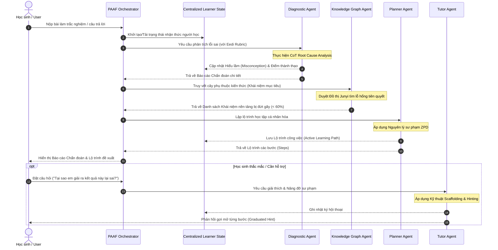

# TÀI LIỆU KIẾN TRÚC HỆ THỐNG AGENTIC AI (PAAF FRAMEWORK)
> **Trạng thái triển khai dữ liệu:** Demo chạy đúng 2 dataset: Eedi 2024 cho Diagnostic Agent (1.869 câu / 2.587 nhãn) và Junyi cho Knowledge Graph Agent (`Info_Content.csv` hierarchy, hoặc `junyi_Exercise_table.csv` nếu có). Ánh xạ Eedi→Junyi là heuristic, không phải bảng chuyên gia. Chạy `python3 demo.py`; đánh giá `python3 evaluate.py` (kết quả `eval/results.json`); tải lại Eedi bằng `python3 -m src.data.download_datasets`. Xem [nguồn và giới hạn dữ liệu](data/README.md). Agent vẫn dùng quy tắc và template.

## Đề tài NCKH: "Nghiên cứu và xây dựng hệ thống Agentic AI hỗ trợ phát hiện lỗ hổng kiến thức và đề xuất lộ trình học tập cá nhân hóa"

---

## 1. TỔNG QUAN HỆ THỐNG (SYSTEM OVERVIEW)

**Pedagogical Agentic AI Framework (PAAF)** là một khung kiến trúc đa tác tử (Multi-Agent Framework) tiên tiến được thiết kế để khắc phục triệt để các hạn chế "hộp đen", tính chất tĩnh và thiếu tương tác của các mô hình chẩn đoán nhận thức/gợi ý bài học truyền thống (như DKT, NeuralCD, CSEAL).

Hệ thống kết hợp năng lực suy luận chuỗi (Chain-of-Thought) của các Mô hình Ngôn ngữ Lớn (LLM) với cấu trúc Đồ thị Kiến thức (Knowledge Graph) và Lý thuyết Sư phạm **Vùng phát triển gần nhất (Zone of Proximal Development - ZPD)** nhằm:
1. **Phát hiện lỗ hổng kiến thức & Hiểu lầm (Misconception Analysis):** Tự động phân tích lý do gốc rễ dẫn đến lỗi sai của học sinh.
2. **Truy vết khái niệm nền tảng bị đứt gãy (Prerequisite Gap Traversal):** Duyệt đồ thị kiến thức để tìm các kỹ năng tiên quyết chưa đạt yêu cầu.
3. **Tạo lộ trình học tập cá nhân hóa động (ZPD Path Generation):** Tự động lập kế hoạch bài học nâng dần độ khó phù hợp với năng lực nhận thức.
4. **Hội thoại nâng đỡ sư phạm (Interactive Scaffolding Dialogue):** Đóng vai trò gia sư thông minh tương tác 2 chiều, đưa ra gợi ý từng bước mà không cung cấp trực tiếp đáp án.

---

## 2. KIẾN TRÚC CÁC TẦNG (LAYERED ARCHITECTURE)

Hệ thống PAAF được cấu trúc thành 5 tầng độc lập nhưng phối hợp chặt chẽ:

```mermaid
graph TD
    subgraph Layer1 [1. Tầng Giao diện & Tương tác (User & Presentation Layer)]
        UI[User Interface / Chat Interface]
    end

    subgraph Layer2 [2. Tầng Điều phối (Agentic Orchestration Layer)]
        PAAF[PAAF Main Framework Orchestrator]
    end

    subgraph Layer3 [3. Tầng Tác tử Chuyên biệt (Specialized Agent Layer)]
        DA[Diagnostic Agent<br/>(CoT Misconception Analysis)]
        KGA[Knowledge Graph Agent<br/>(Prerequisite Gap Traversal)]
        PA[Planner Agent<br/>(ZPD Dynamic Path Routing)]
        TA[Tutor Agent<br/>(Scaffolding Dialogue)]
    end

    subgraph Layer4 [4. Tầng Bộ nhớ & Trạng thái (Core Memory & State Layer)]
        CLS[(Centralized Learner State)]
        PKG[(Prerequisite Knowledge Graph)]
    end

    subgraph Layer5 [5. Tầng Dữ liệu & Công cụ (Data & Benchmark Layer)]
        EEDI[(Dataset Eedi - Diagnostic Questions)]
        JUNYI[(Dataset Junyi - Concept Graph)]
        LLM[LLM Engine / API]
    end

    UI <--> PAAF
    PAAF --> DA
    PAAF --> KGA
    PAAF --> PA
    PAAF --> TA

    DA <--> CLS
    KGA <--> PKG
    KGA <--> CLS
    PA <--> CLS
    TA <--> CLS

    DA <--> EEDI
    KGA <--> JUNYI
    DA <--> LLM
    TA <--> LLM
```

---

## 3. LUỒNG XỬ LÝ ĐA TÁC TỬ (MULTI-AGENT WORKFLOW)

Quy trình xử lý một bài làm của học sinh qua các tác tử diễn ra theo thứ tự tuyến tính kết hợp vòng lặp phản hồi:



---

## 4. CHI TIẾT CÁC MÔ HÌNH TÁC TỬ (SPECIALIZED AGENTS)

### 4.1. Diagnostic Agent (Tác tử Chẩn đoán Lỗ hổng)
* **Chức năng:** Nhận dữ liệu câu hỏi (dạng Eedi Diagnostic Questions) và đáp án sai do học sinh chọn, tiến hành **Suy luận chuỗi (Chain-of-Thought - CoT)** để tìm ra nguyên nhân gốc rễ.
* **Đầu ra:** 
  * Xác định nhãn Hiểu lầm cụ thể (Misconception Name).
  * Đánh giá mức độ nghiêm trọng (Severity: High / Medium / Low).
  * Giải thích chi tiết luồng tư duy sai của học sinh.

### 4.2. Knowledge Graph Agent (Tác tử Đồ thị Kiến thức)
* **Chức năng:** Sử dụng thuật toán duyệt đồ thị (Graph Traversal) trên cấu trúc Đồ thị phụ thuộc khái niệm (Junyi Concept Dependency Graph).
* **Đầu ra:** Danh sách các khái niệm tiên quyết (Prerequisite Concepts) bị thiếu hụt kiến thức (có điểm thành thạo $< 60\%$), sắp xếp từ cấp độ nền tảng đến nâng cao.

### 4.3. Planner Agent (Tác tử Lập Lộ trình ZPD)
* **Chức năng:** Đóng vai trò chuyên gia thiết kế giáo trình cá nhân hóa. Áp dụng lý thuyết **Vùng phát triển gần nhất (ZPD)** để xây dựng chuỗi bài học.
* **Cấu trúc Lộ trình 3 Giai đoạn:**
  1. *Giai đoạn 1 (Củng cố nền tảng):* Học lại các khái niệm tiên quyết bị đứt gãy.
  2. *Giai đoạn 2 (Khắc phục hiểu lầm):* Bài tập tập trung sửa lỗi sai vừa mắc phải.
  3. *Giai đoạn 3 (Đạt chuẩn mục tiêu):* Thực hành bài tập mức độ ZPD nâng cao.

### 4.4. Tutor Agent (Tác tử Trợ giảng Hội thoại Scaffolding)
* **Chức năng:** Tương tác 2 chiều với học sinh khi họ gặp khó khăn trong quá trình học.
* **Nguyên tắc Sư phạm:**
  * **Không cho ngay đáp án:** Sử dụng kỹ thuật *Graduated Hinting* (Gợi ý tăng dần).
  * **Gợi mở nhận thức:** Đặt câu hỏi phản tư để học sinh tự nhận ra lỗi sai ở đâu.

---

## 5. TÀI NGUYÊN MÃ NGUỒN VÀ DỮ LIỆU (IMPLEMENTATION DETAILS)

Mã nguồn hệ thống đã được triển khai hoàn chỉnh trong thư mục dự án với cấu trúc:

```
LearnAgent/
├── demo.py                          # Kịch bản thực nghiệm Multi-Agent trên Benchmark Datasets
├── evaluate.py                      # Đánh giá protocol Eedi + Junyi → eval/results.json
├── SYSTEM_ARCHITECTURE.md           # Tài liệu diễn giải kiến trúc hệ thống PAAF
├── abc.text                         # Đề cương & ghi chú NCKH
├── data/                            # Thư mục lưu trữ bộ dữ liệu thực nghiệm Benchmark
│   ├── raw/eedi/                     # train.csv và misconception_mapping.csv thật
│   ├── junyi/archive/                # Info_Content.csv (đồ thị phân cấp); Log_Problem không nạp
│   ├── sources.json                  # Nguồn tải và checksum
│   ├── README.md                     # Hướng dẫn và giới hạn
│   └── fixtures/                     # JSON giả lập cũ, không dùng lúc chạy
└── src/
    ├── core/
    │   ├── learner_state.py         # Trạng thái người học trung tâm (Centralized Learner State)
    │   └── knowledge_graph.py       # Đồ thị phụ thuộc kiến thức & Thuật toán duyệt đồ thị
    ├── data/
    │   ├── dataset_loaders.py       # Eedi questions + Junyi graph, không fallback giả lập
    │   └── concept_mapping.py       # Ánh xạ heuristic Eedi construct → node Junyi
    ├── agents/
    │   ├── base_agent.py            # Khung Lớp cơ sở cho các Agent
    │   ├── diagnostic_agent.py      # Diagnostic Agent (Phân tích lỗi CoT)
    │   ├── kg_agent.py              # Knowledge Graph Agent (Truy vết tiên đề)
    │   ├── planner_agent.py         # Planner Agent (Lập lộ trình ZPD)
    │   └── tutor_agent.py            # Tutor Agent (Hội thoại Scaffolding 2 chiều)
    └── orchestrator/
        └── paaf_framework.py        # Framework Điều phối Multi-Agent trung tâm
```

---

## 6. ĐÓNG GÓP KHOA HỌC CHO ĐỀ TÀI NCKH

1. **Khắc phục tính "Hộp đen":** Diagnostic Agent mang lại khả năng giải thích bằng ngôn ngữ tự nhiên về *lý do tại sao* học sinh sai, thay vì chỉ trả về một số xác suất thô.
2. **Khắc phục tính "Tĩnh" của Lộ trình:** Planner Agent phối hợp với Knowledge Graph Agent tự động điều chỉnh lộ trình học theo từng thời điểm dựa trên năng lực thực tế.
3. **Bổ sung tính Tương tác Sư phạm:** Tutor Agent giải quyết bài toán thiếu tương tác 2 chiều trong các hệ thống gợi ý bài học truyền thống, đảm bảo nguyên lý Scaffolding trong khoa học giáo dục.
