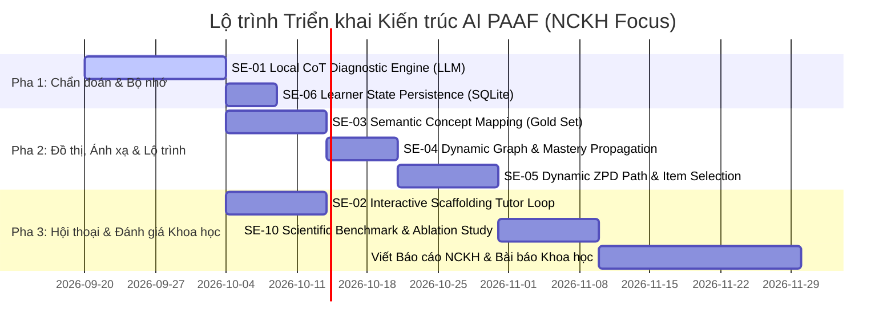

# DANH SÁCH TASK — HỆ THỐNG AGENTIC AI (PAAF FRAMEWORK)

> **Đề tài NCKH:** Nghiên cứu và xây dựng hệ thống Agentic AI hỗ trợ phát hiện lỗ hổng kiến thức và đề xuất lộ trình học tập cá nhân hóa.
> 
> **Phạm vi trọng tâm:** Tập trung 100% vào **Kiến trúc AI, Thuật toán Multi-Agent, Bộ nhớ Trạng thái và Bộ Đánh giá Thực nghiệm Khoa học** (Phục vụ viết Báo cáo NCKH & Bài báo Khoa học). Giao diện Web App và API tích hợp sẽ thực hiện sau khi hoàn thiện khung AI.
> 
> **Định hướng kỹ thuật:** Triển khai Local / Open-Weights LLM (suy luận nội bộ qua Ollama / vLLM, ví dụ Qwen2.5-7B-Instruct / Llama-3.1-8B), loại bỏ phụ thuộc API bên ngoài để đảm bảo tính tái lập khoa học (scientific reproducibility), bảo mật dữ liệu và không phát sinh chi phí.

---

## 1. Danh sách Task Chi tiết (Hệ thống AI)

| STT | Mã Task | Khối chức năng | Hiện trạng | Mô tả yêu cầu | Tiêu chí chấp nhận | Nhánh push code | Tên Commit | Ghi chú | Trạng thái thực hiện | Ngày bắt đầu | Deadline |
| :---: | :--- | :--- | :--- | :--- | :--- | :--- | :--- | :--- | :---: | :---: | :---: |
| **1** | `SE-01` | Chẩn đoán AI (CoT Diagnostic) | Local CoT Engine Few-shot + Pydantic Guardrails | **Local CoT Diagnostic Engine:** Few-shot CoT Prompting trên Local Open-Weights LLM (Qwen2.5-7B-Instruct / Llama-3.1-8B qua Ollama/vLLM). Input: Đề bài, 4 lựa chọn, đáp án học sinh. Output JSON: `misconception_id` (hoặc `unlabeled`), `cot_reasoning`, `confidence_score`. Gộp Guardrail (Pydantic schema + retry). | - Suy luận Local 100%, 0đ API cost. - Parse JSON hợp lệ $\ge 98\%$ trên tập test. - Đánh giá **Macro-F1 misconception** trên option có nhãn Eedi so với Rule-based lookup baseline. - Ghi rõ Model version & Seed trong báo cáo để tái lập. | `feature/SE-01` | `[SE-01] Implement Local CoT Diagnostic Engine` | Cốt lõi phần Chẩn đoán cho Báo cáo | Đã hoàn thành | 2026-09-20 | 2026-09-27 |
| **2** | `SE-02` | Gia sư Sư phạm (Scaffolding Dialogue) | Multi-turn Tutor Engine 3 cấp Graduated Hinting (Nudge->Hint->Explanation) | **Interactive Scaffolding Loop:** Local LLM hội thoại đa lượt (Multi-turn), triển khai Graduated Hinting 3 cấp (*Nudge -> Hint -> Explanation*). Đọc `interaction_history` trong `LearnerState`. Cấm tuyệt đối chép thẳng đáp án đúng. | - Cùng misconception, gợi ý lần 2 cụ thể hơn lần 1. - Tỉ lệ rò rỉ đáp án đúng $\le 1.3\%$ (không tăng so với template cũ). - Duy trì ngữ cảnh hội thoại $\ge 3$ lượt liên tiếp trong 1 phiên. | `feature/SE-02` | `[SE-02] Implement Interactive Scaffolding Tutor Loop` | Nguyên lý sư phạm Scaffolding Vygotsky | Đã hoàn thành | 2026-09-20 | 2026-09-27 |
| **3** | `SE-03` | Ánh xạ Khái niệm (Semantic Mapping) | Hybrid Concept Mapper (SentenceTransformers Embedding + Cosine Similarity) | **Semantic Mapping 2 Bước:** (1) Gán tay bộ **Gold Set 100-200 Eedi constructs → Junyi nodes** (freeze test split). (2) Triển khai Local Semantic Embedding (`bge-m3` hoặc `all-MiniLM-L6-v2`) + Cosine Similarity so sánh với Heuristic. Xuất `eedi_junyi_semantic_map.json`. | - Có bộ Gold Set chuẩn hóa kèm tài liệu mô tả. - Đạt Top-1 & Top-3 Accuracy đo trực tiếp trên Gold Set. - 0 ID bịa nằm ngoài Junyi Graph. - Heuristic cũ giữ lại làm Baseline trong `evaluate.py`. | `feature/SE-03` | `[SE-03] Implement Hybrid Semantic Concept Mapping` | Ánh xạ dữ liệu Eedi - Junyi | Đã hoàn thành | 2026-09-20 | 2026-09-27 |
| **4** | `SE-04` | Đồ thị Kiến thức & Năng lực (KG & Mastery) | Cập nhật lan truyền điểm thành thạo thời gian thực | **Dynamic Graph & Session Mastery Propagation:** Cập nhật điểm thành thạo lan truyền trên `LearnerState` sau mỗi câu làm (đúng tăng, sai giảm), sau đó duyệt lại cây tiên quyết Junyi theo thời gian thực. | - Unmapped: Không bịa cạnh tiên quyết. - Mapped: Danh sách `unmastered_prerequisites` **thay đổi động** khi `mastery` thay đổi trong phiên. - Log rõ `graph_kind` & nguồn cạnh trong kết quả eval. | `feature/SE-04` | `[SE-04] Implement Dynamic Mastery Propagation` | Tích hợp thuật toán lan truyền năng lực nhận thức | Đã hoàn thành | 2026-09-20 | 2026-09-20 |
| **5** | `SE-05` | Lập Lộ trình Cá nhân hóa (Dynamic ZPD Planner) | Dynamic ZPD Path & Question Selection với real Eedi item IDs | **Dynamic ZPD Path & Item Selection:** Từ chẩn đoán + prereq Junyi, truy vấn **câu hỏi Eedi thật** (cùng construct/misconception). Tự động Re-plan trong phiên khi học sinh làm câu tiếp theo (đúng liên tiếp -> tăng độ khó; sai -> lùi về prereq). | - Mỗi bước `practice`/`remediate` gắn với `question_id` Eedi thật tồn tại. - Lộ trình lần 2 tự động thay đổi dựa trên kết quả làm bài câu 1. - Trình bày giả mã thuật toán ZPD Routing trong báo cáo NCKH. | `feature/SE-05` | `[SE-05] Implement Dynamic ZPD Learning Path` | Đóng góp cốt lõi về Lộ trình ZPD cho NCKH | Đã hoàn thành | 2026-10-21 | 2026-10-30 |
| **6** | `SE-06` | Bộ nhớ & Trạng thái Agent (Learner State Persistence) | SQLite Local Learner State Repository persistence | **Agent Memory Persistence:** Lưu trữ bền vững `LearnerState` (mastery, misconception history, learning path, chat logs) bằng SQLite local để các agent chạy liên tục qua nhiều câu hỏi / phiên học. | - Nộp câu 1 rồi câu 2: load đúng `student_id`, điểm `mastery` tích lũy không bị reset. - Tutor Agent đọc được lịch sử tương tác của các câu trước đó. | `feature/SE-06` | `[SE-06] Implement Learner State Persistence` | Cần thiết để đánh giá phiên học dài hạn | Đã hoàn thành | 2026-10-04 | 2026-10-08 |
| **7** | `SE-10` | Thử nghiệm & Đánh giá Khoa học (Evaluation Benchmark) | Offline Scientific Benchmark & Full Ablation Study export `eval/results/` | **Scientific Benchmark & Ablation Study:** (1) Giữ protocol hiện có; (2) Đo Macro-F1 Diagnostic LLM vs Eedi labels; (3) **Ablation Study:** Full PAAF vs No-KG vs No-Planner vs No-Tutor vs Single LLM Baseline; (4) Đo Path Coherence & ZPD Alignment. | - Script tự động chạy benchmark toàn bộ các biến thể, xuất báo cáo vào `eval/results/`. - Sinh bảng biểu số liệu khoa học so sánh PAAF với Baseline phục vụ viết bài báo. | `feature/SE-10` | `[SE-10] Scientific Benchmark and Ablation Study` | Đánh giá thực nghiệm & Ablation Study | Đã hoàn thành | 2026-09-27 | 2026-09-27 |

---

## 2. Danh mục Task Tích hợp Nền tảng Khảo thí Online (Azota / Study4 Orientation)

| STT | Mã Task | Khối chức năng | Hiện trạng | Mô tả chi tiết | Tiêu chí chấp nhận | Nhánh push code | Tên Commit | Ghi chú | Trạng thái thực hiện | Ngày bắt đầu | Deadline |
| :---: | :--- | :--- | :--- | :--- | :--- | :--- | :--- | :--- | :---: | :---: | :---: |
| **8** | `SE-07` | Tối ưu Agent, REST API & Web UI | Hợp nhất Agent & Web Demo tổng quát | Hợp nhất Tối ưu Hệ thống Multi-Agent & Triển khai Giao diện Web App Demo tổng quát | - Lỗi kết nối không suy giảm mastery - FastAPI response $\le 500\text{ms}$ | `feature/SE-07` | `[SE-07] Consolidate Multi-Agent Systems & Web App Demo` | Tạm dừng để ưu tiên định hướng Nền tảng Khảo thí | Tạm dừng (Pending) | 2026-10-01 | 2026-10-10 |
| **9** | `SE-11` | REST API Service Nền tảng Khảo thí | Chưa có API Gateway nhận payload bài thi Azota | **API Webhook & Integration Gateway cho Nền tảng Thi Trắc nghiệm (Azota / Study4 / Tuyensinh247):** - Xây dựng API bất đồng bộ (`POST /api/v1/assessment/submit`, `POST /api/v1/assessment/diagnose-submission`). - Tiếp nhận payload nộp bài thi gồm: `student_id`, `test_id`, danh sách câu hỏi và phương án học sinh chọn. | API tiếp nhận payload nộp bài thi $\le 500\text{ms}$ (rule-based) / $\le 3\text{s}$ (local LLM), trả về cấu trúc kết quả chẩn đoán toàn bài thi. | `feature/SE-11` | `[SE-11] Implement Online Assessment REST API Gateway` | Tích hợp luồng nộp bài thi trắc nghiệm Azota/Study4 | Đã hoàn thành | 2026-10-01 | 2026-10-05 |
| **10** | `SE-12` | Module Chẩn đoán & Thẻ Nhãn Lỗi Bài thi | Chưa hiển thị thẻ chẩn đoán CoT cho câu sai trong bài thi | **Post-Submission CoT Diagnostic & Misconception Badging:** - Lọc tất cả các câu trả lời sai trong bài thi trắc nghiệm. - Chạy Diagnostic Agent để suy luận nguyên nhân ngộ nhận CoT và gán nhãn hiểu lầm (`misconception_id`) cho từng câu sai. | Hiển thị Thẻ Chẩn đoán CoT (Misconception Badge) chi tiết nguyên nhân gốc rễ bên cạnh từng câu làm sai. | `feature/SE-12` | `[SE-12] Implement Post-Submission Diagnostic & Misconception Badging` | Gán nhãn hiểu lầm & CoT reasoning cho câu làm sai | Chưa bắt đầu | 2026-10-06 | 2026-10-10 |
| **11** | `SE-13` | Module Lộ trình Ôn tập ZPD Sau Bài thi | Chưa tự động sinh lộ trình ôn tập sau khi nộp bài thi | **Post-Exam Automated ZPD Remediation Path Generator:** - Tổng hợp danh sách câu sai $\rightarrow$ Tra cứu Đồ thị Kiến thức Junyi $\rightarrow$ Xác định các nút tiên quyết bị đứt gãy. - Tự động đề xuất Lộ trình ôn tập 3-5 câu hỏi Eedi thật khắc phục điểm yếu vừa bộc lộ trong bài thi. | Đề xuất lộ trình khắc phục đúng vùng ZPD ngay sau khi nộp bài thi; 100% bước gắn với question_id Eedi thật. | `feature/SE-13` | `[SE-13] Implement Post-Exam Automated ZPD Remediation Path` | Tự động tạo bài tập ôn tập ZPD sau bài kiểm tra | Chưa bắt đầu | 2026-10-11 | 2026-10-15 |
| **12** | `SE-14` | Giao diện Báo cáo Thi & Chat Trợ giảng AI | Chưa có UI Báo cáo thi & Widget Chat Tutor AI | **Interactive Post-Test Dashboard & Tutor Scaffolding Widget:** - Xây dựng giao diện Web báo cáo kết quả thi trực quan (phong cách Azota/Study4). - Khung Chat Gia sư AI nhúng bên cạnh bài thi cho phép học sinh bấm vào từng câu sai để nhận gợi ý sư phạm 3 cấp (*Nudge $\rightarrow$ Hint $\rightarrow$ Explanation*). | Trực quan hóa kết quả thi, lộ trình ZPD và tương tác chat mượt mà với Tutor AI mà không lộ đáp án đúng. | `feature/SE-14` | `[SE-14] Implement Post-Test Dashboard & Tutor Scaffolding Widget` | Màn hình báo cáo thi Azota + Chat Gia sư 3 cấp | Chưa bắt đầu | 2026-10-16 | 2026-10-25 |
| **13** | `SE-01b` | Fine-tuning LLM (LoRA/QLoRA) | Đang dùng Few-shot CoT trên mô hình gốc | Tinh chỉnh mô hình Qwen2.5 / Llama-3.1 bằng LoRA trên Eedi Diagnostic Question dataset nếu Few-shot CoT chưa đạt F1 mục tiêu. | F1 chẩn đoán tăng $\ge 5\%$. | `feature/SE-01b` | `[SE-01b] Fine-tune LLM for Diagnostic Reasoning` | Dự phòng khi Few-shot chưa đủ F1 | Dự phòng | - | - |
| **14** | `SE-04b` | BKT & Graph Neural Networks | Đang dùng lan truyền thành thạo thời gian thực | Áp dụng Bayesian Knowledge Tracing (BKT) trên lịch sử làm bài Junyi thật (chỉ làm khi nạp thành công log tương tác). | Sau `SE-04` | `feature/SE-04b` | `[SE-04b] Implement BKT and GNN Knowledge Tracing` | Yêu cầu nạp log tương tác Junyi thật | Dự phòng | - | - |
| **15** | `SE-08` | Local Vector DB (ChromaDB) | Đang dùng ItemRepository in-memory | Triển khai ChromaDB local cho RAG ngân hàng câu hỏi nếu lọc theo construct/embedding cơ bản chưa đủ nhanh. | Sau `SE-05` | `feature/SE-08` | `[SE-08] Implement Local Vector DB for Item Retrieval` | Triển khai khi ngân hàng câu hỏi mở rộng lớn | Dự phòng | - | - |
| **16** | `SE-15` | Guardrails Nâng cao (Outlines/NeMo) | Đang dùng Pydantic Schema + Retry | Tích hợp thư viện Outlines / NeMo Guardrails để kiểm soát chặt chẽ hơn nữa output của LLM. | Sau `SE-01` & `SE-02` | `feature/SE-15` | `[SE-15] Implement Advanced LLM Guardrails` | Dự phòng nâng cao tính an toàn suy luận LLM | Dự phòng | - | - |

---

## 3. Sơ đồ Tiến độ Triển khai NCKH (Gantt Chart - AI Core Focus)

---

## 4. Ràng buộc Khoa học & Chuẩn mực NCKH

1. **Tính Trung thực Dữ liệu:** Không tự tạo (bịa) nhãn Misconception, cạnh Đồ thị Junyi hoặc ID ánh xạ không có thực trong bộ dữ liệu gốc.
2. **Minh bạch Giới hạn Dữ liệu:** Phải ghi rõ trong báo cáo bài báo: Eedi 2024 không phải NeurIPS 2020; Junyi `Info_Content` là cây phân cấp (hierarchy), không phải đồ thị phụ thuộc chuyên gia; ánh xạ Eedi-Junyi cần được đo trên bộ Gold Set gán tay.
3. **Tính Đóng góp Khoa học của Agentic AI:** Phải chứng minh được hiệu quả của kiến trúc Multi-Agent PAAF thông qua **Ablation Study** (so sánh với Single LLM, Non-Agentic DKT, Rule-based), không chỉ dừng lại ở kịch bản Demo CLI đơn lẻ.
